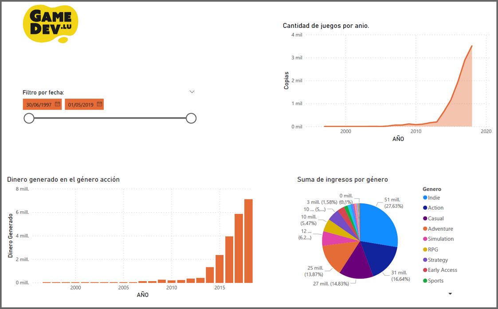

# Trabajo Practico Integrador

Es el proyecto que haras en el taller de dashboard.

## Objetivos 

1. Realizar un desafio de analisis de negocio basado en datos para aplicar indicadores claves (KPIs), OKRs y dreacion de un Dashboard.
2. Desarrollar una mirada critica sobre el caso real.
3. Fijar los conocimientos construidos durante la cursada de la materia.

## En que consiste?

El TPI consiste en definir OKRs, KPIs y armar un dashboard donde utilizarás conceptos que aprendimos en el módulo.

Deberán tomar los datos que les suministraremos para realizar cada una de las actividades.

El trabajo lo realizarás en equipo (de hasta 4 estudiantes no menos de 3) y lo presentarán en la clase.

## Desafio

Steam es una plataforma de videojuegos que permite activar, dedscargar y jugar juegos en computadora. La compañía posee muchos datos sobre los juegos, sus creadores, la cantidad de tiempo promedio que juega la gente, etc.

Estan desesperados por implementar OKRs y KPIs y un Dashboard en looker studio.

Vos sos parte del equipo directivo de STEAM.

En el excel se encontraran los datos de los juegos que hay en la plataforma. Las columnas son:

- appid: Número de identificación.
- name: Nombre del juego.
- release_date: Fecha de lanzamiento.
- english: Si está o no en inglés. 
- developer: Desarrollador.
- publisher: Quién lo publica.
- platforms: Plataformas.
- required_age: Edad requerida.
- categories: Categorías.
- genres: Géneros son las caracteristicas (ej: acción, Free to Play)
- steamspy_tags: Etiquetas
- achievements: Logros
- positive_ratings: Valoraciones positivas.
- negative_ratings: Valoraciones negativas.
- average_playtime: Tiempo de juego promedio.
- median_playtime: Tiempo de juego medio.
- owners: Propietarios.
- price: Precio

Es importante que realicen una copia de esta presentacion y completen todas las actividades, de esa manera podras usar esta misma presentacion para exponer tu trabajo.

### 1. Kickoff del proyecto

Contar brevemente que proyecto de analisis desarrollaran. Si bien sera sobre STEAM, puede que sean una empresa desarrolladora de juegos, la competencia, un gamer que quiere stremear juegos,... Ustedes deciden.

### 2. Objetivos: Cuales son los objetivos que quieren lograr?

Define al menos dos Objetivos (O), relacionados con el analisis de datos, siguiendo la metodologia OKRs (Objetivos y Resultados Clave).

Para cada Objetivo, especifica al menos dos Resultados Clave (KRs), que ayudaran a medir el progreso y el logro de los objetivos.

### 3. KPIs

Define al menos tres KPI, identificando unidades y dimensiones.

### 4. Construccion del dashboard

Crea un dashboard que incluya como minimo 2 graficos.

## Ejemplo de proyecto

### 1. Kickoff del proyecto

GameDev es una empresa emergente en el ambito del desarrollo de videojuegos. Hasta la fecha, la compañía ha destacado por ofrecer servicios de desarrollo a algunas de las principales empresas del mercado. Ahora, respaldada por años de experiencia acumulada, GameDev se encuentra lista para embarcarse en el lanzamiento de su primer videojuego original. Este proyecto tiene como objetivo principal el analisis detallado de juegos en la plataforma Steam, con el proposito de identificar patrones y tendencias que nos guiaran hacia la creacion de un titulo con el potencial de ser un exito.

### 2. Objetivos: Cuales son los objetivos que quieren lograr?

1. Desarrollar un Concepto Innovador de Juego:
    - KR 1: Realizar un analisis exhaustivo de tendencias de juegos en Steam para identificar oportunidades de innovacion.
    - KR 2: Crear y refinar tres conceptos de juego originales que se alineen con las tendencias identificadas.
2. Desarrollar un Prototipo Funcional y Atractivo:
    - KR 1: Desarrollar un prototipo jugable del juego que incluya mecanicas clave y una experiencia de usuario atractiva.
    - KR 2: Validar la factibilidad tecnica y establecer un calendario de desarrollo para la version final.
3. Lanzar el Juego y Obtener una Recepcion Positiva
    - KR 1: Lanzar el juego en la plataforma Steam con una estrategia de marketing solida y una campaña de promocion efectiva.

### 3. KPIs

1. Tasa de generos en el Mercado de Steam: Este KPI mide el porcentaje de genero de los diferentes generos en el mercado de Steam.
2. Indice de Satisfaccion de los Usuarios con los Juegos: Realizar encuestas o recopilar informacion de usuarios para evaluar la recepcion de los juegos. Un alto indice de satisfaccion indica que los conceptos estan alineados con las expectativas y tendencias identificadas.
3. Nivel de Compromiso en las Redes Sociales: Rastrear la participacion en las redes sociales, como comentarios, compartidos y likes, relacionados con la promocion de los conceptos de juego. Esto puede proporcionar una indicacion temprana de la recepcion del publico.

### 4. Construccion del dashboard

