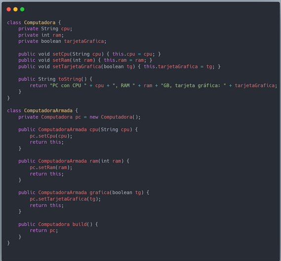
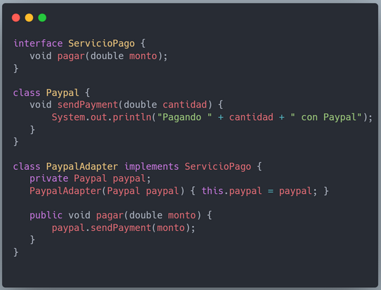
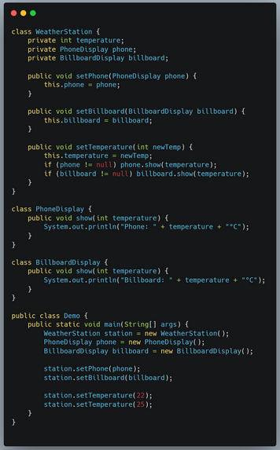
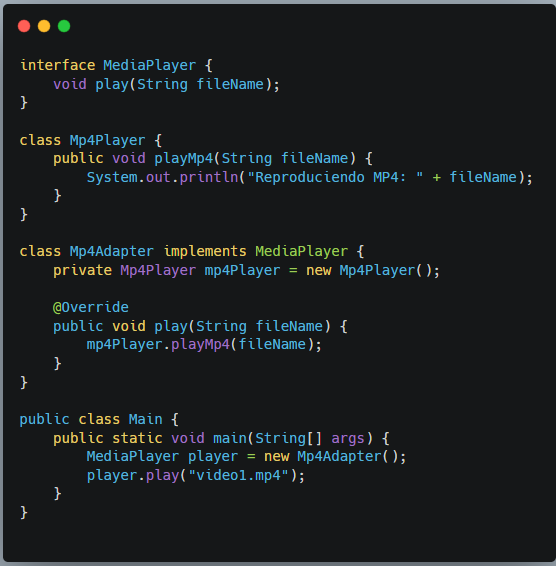

Pregunta 1 ¿Cuál de los siguientes es un ejemplo del patrón Decorator?

    a. Una clase que hereda de otra y sobreescribe un método.
    b.Una clase que añade dinámicamente responsabilidades adicionales a un objeto sin modificar su código.
    c.Un objeto que avisa a otros cuando cambia.
    d.Un método que devPregunta 42 El patrón Observer implica necesariamente que el "sujeto" conozca en detalle la implementación de sus observadores.

    a. Verdadero
    b. Falsoe diferentes tipos de objetos.

Pregunta 2 Si un sistema complejo tiene alta interacción entre objetos, pero el énfasis del análisis está en qué objetos colaboran y no en el orden exacto de mensajes, ¿qué diagrama es más recomendable?

    a.Diagrama de colaboración
    b.Diagrama de estados.
    c.Diagrama de clases.
    d.Diagrama de secuencia.

Pregunta 3 Un sistema de gestión bancaria necesita permitir distintos cálculos de comisiones según el tipo de cuenta, pero en el futuro se agregarán nuevos tipos de cuenta.
¿Cuál de los siguientes enfoques es más alineado con OCP y LSP?

    a.Usar una clase Cuenta con un método calcularComision() y un switch para cada tipo de cuenta.
    b.Definir Cuenta como clase abstracta con calcularComision() y que cada subclase (CuentaAhorro, CuentaCorriente) lo implemente.
    c.Usar una clase GestorComisiones con métodos estáticos que reciben el tipo de cuenta.
    d.Tener una sola clase Cuenta con múltiples métodos calcularComisionAhorro, calcularComisionCorriente

Pregunta 4 ¿Cuál de los siguientes pares es correcto?

    a.Observer – Estructural
    b.Adapter – De comportamiento
    c.Singleton – Creacional
    d.Strategy – Creacional

Pregunta 5 ¿En qué se diferencian Prototype y Singleton?

    a.Prototype usa herencia, Singleton no.
    b.Prototype se centra en clonar objetos existentes, Singleton en restringir la creación a una sola instancia.
    c.Ambos evitan la creación con new, pero Singleton obliga a clonar siempre.
    d.Singleton pertenece a patrones de comportamiento, Prototype a estructurales.

Pregunta 6 ¿Cuál de las siguientes opciones aplica mejor el principio de Inversión de Dependencias (DIP)?

    a. Una clase concreta depende directamente de otra clase concreta.
    b. Una subclase redefine todos los métodos de su clase base.
    c. Una clase gestiona tanto la lógica de negocio como el almacenamiento en base de datos.
    d. Un módulo de alto nivel depende de una abstracción (interfaz), y el módulo de bajo nivel implementa dicha abstracción.

Pregunta 7 ¿Qué combinación de principios SOLID actúa principalmente para reducir el acoplamiento entre módulos?

    a. OCP + LSP
    b. ISP + DIP
    c. SRP + ISP
    d. SRP + OCP

Pregunta 8 ¿Qué patrón GRASP busca minimizar el acoplamiento entre clases para aumentar la reutilización y facilidad de mantenimiento?

    a. High Cohesion
    b. Pure Fabrication
    c. Low Coupling
    d. Indirection

Pregunta 9 ¿Qué patrón GRASP sugiere asignar la responsabilidad de manejar una tarea a la clase que tiene la información necesaria para cumplirla?

    a. Controller
    b. Information Expert
    c. Creator
    d. Polymorphism

Pregunta 10 Con Builder se puede aplicar el mismo proceso de construcción para generar distintos objetos finales

    a. Verdadero
    b. Falso 

Pregunta 11 ¿Qué patrón de diseño estamos aplicando en el siguiente código?

    a. Builder
    b. Adapter
    c. Observer
    d. Decorator

Pregunta 12 Un Observer se suscribe a un sujeto y recibe notificaciones cuando hay cambios

    a. Verdadero
    b. Falso 

Pregunta 13 ¿Cuál es la principal diferencia entre los patrones Factory Method y Abstract Factory?

    a. Factory Method define una interfaz para crear un objeto, pero delega en las subclases la decisión de cuál instanciar; Abstract Factory crea familias de objetos relacionados sin especificar sus clases concretas.
    b. Factory Method crea múltiples objetos de familias distintas, Abstract Factory solo uno.
    c. Abstract Factory necesita herencia obligatoria, Factory Method no.
    d. No hay diferencia, ambos son equivalentes.

Pregunta 14 ¿Qué intenta evitar el principio de Segregación de Interfaces (ISP)?

    a. Que una interfaz obligue a las clases que la implementan a depender de métodos que no usan.
    b. Que una clase herede múltiples interfaces.
    c. Que las interfaces usen herencia múltiple.
    d. Que las clases tengan demasiados constructores.

Pregunta 15 ¿Qué patrón sería más adecuado si necesitamos definir un esqueleto de algoritmo en una clase base, dejando que las subclases redefinan ciertos pasos sin cambiar la estructura general?

    a. Observer
    b. Template Method
    c. Builder
    d. Strategy

Pregunta 16 El patrón Observer es útil cuando…

    a. Queremos convertir una clase en abstracta.
    b. Necesitamos separar la interfaz de la implementación.
    c. Queremos que un objeto notifique automáticamente a otros cuando cambia su estado.
    d. Queremos tener solo una instancia global en el sistema.

Pregunta 17 ¿Que patrón se debería aplicar en este caso?

Un sistema de chat debe notificar a todos los clientes conectados cuando un usuario envía un mensaje.

    a. Decorator
    b. Builder
    c. Adapter
    d. Observer

Pregunta 18 ¿Cuál es el objetivo central de los patrones GRASP?

    a. Orientar la asignación de responsabilidades en objetos de un sistema orientado a objetos.
    b. Sustituir por completo los patrones GoF.
    c. Mejorar el rendimiento en tiempo de ejecución.
    d. Proporcionar estructuras de código listas para usar.

Pregunta 19 ¿Qué patrón de diseño estamos aplicando en este caso?

    a. Observer
    b. Adapter
    c. Decorator
    d. Builder

Pregunta 20 Una clase Rectangulo tiene métodos setAncho y setAlto. Si se crea una subclase Cuadrado que redefine de distinto modo estos métodos, ¿qué principio se podría estar violando?

    a. Dependency Inversion Principle
    b. Liskov Substitution Principle
    c. Single Responsibility Principle
    d. Open/Closed Principle

Pregunta 21 ¿Qué patrón se debería aplicar en este caso?

Querés que una clase Imagen pueda agregarse con marco, filtro y sombreado sin cambiar su código original.

    a. Observer
    b. Builder
    c. Decorator
    d. Adapter

Pregunta 22 ¿Qué afirmación describe mejor la relación entre Liskov Substitution Principle (LSP) y herencia?

    a. LSP asegura que los objetos de una subclase puedan reemplazar a los de la superclase sin alterar la corrección del programa.
    b. LSP aplica solo a interfaces, no a clases concretas.
    c. LSP es opcional cuando las subclases agregan métodos nuevos.
    d. LSP implica que las subclases siempre deben sobreescribir todos los métodos de la superclase.

Pregunta 23 El patrón Decorator puede usarse para extender funcionalidades sin necesidad de modificar la clase base.

    a. Verdadero
    b. Falso 

Pregunta 24 ¿Qué patrón se tendría que implementar en este ejemplo?

    a. Adapter
    b. Builder
    c. Decorator
    d. Observer

Pregunta 25 ¿Cuál de los siguientes es un patrón creacional?

    a. Singleton
    b. Observer
    c. Strategy
    d. Adapter

Pregunta 26 ¿Cuál es la diferencia principal entre Controller e Information Expert?

    a. No hay diferencia, son sinónimos.
    b. Controller es exclusivo de interfaces gráficas, Information Expert de persistencia.
    c. Controller delega responsabilidades de coordinación, Information Expert las asigna al objeto que tiene los datos relevantes.
    d. Controller maneja la lógica de dominio y Information Expert solo eventos del usuario.

Pregunta 27 ¿Cuál de los siguientes escenarios aplica mejor el patrón Creator?

    a. Una clase que usa intensamente instancias de otra es responsable de crearlas
    b. Se introduce una clase intermedia para desacoplar dos módulos.
    c. Una clase decide su comportamiento según múltiples condicionales.
    d. Una clase maneja eventos externos en lugar de delegarlos.

Pregunta 28 ¿Qué ventaja clave tienen los diagramas de colaboración frente a los de secuencia?

    a. Representan mejor los hilos concurrentes.
    b. Son más expresivos en cuanto al orden cronológico de los mensajes.
    c. Muestran más claramente las asociaciones entre objetos que participan en la interacción.
    d. Permiten representar estructuras de control como bucles o condicionales.

Pregunta 29 En un sistema de videojuegos, se requiere que los personajes tengan diferentes comportamientos de ataque que puedan cambiar en tiempo de ejecución.

¿Qué patrón aplicarías y qué principio SOLID se respeta?

    a. Strategy, respetando OCP porque se pueden añadir nuevos ataques sin modificar el código existente
    b. Observer, respetando SRP porque cada clase tiene una sola responsabilidad.
    c. Adapter, respetando DIP porque traduce interfaces incompatibles
    d. Singleton, respetando LSP porque todos los personajes comparten la misma instancia.

Pregunta 30 ¿Qué patrón GRASP recomienda asignar la responsabilidad de manejar una variación de comportamiento a diferentes subclases, en lugar de usar sentencias condicionales?

    a. Controller
    b. Indirection
    c. Pure Fabrication
    d. Polymorphism

Pregunta 31 ¿Qué patrón es más útil cuando quieres ofrecer una interfaz simplificada a un subsistema complejo, sin restringir el acceso a su funcionalidad completa?

    a. Facade
    b. Mediator
    c. Proxy
    d. Adapter

Pregunta 32 En un diagrama de secuencia, ¿qué indica una flecha asíncrona (línea continua con punta abierta)?

    a. Que el mensaje está prohibido en UML 2.
    b. Que el receptor responde inmediatamente.
    c. Que se trata de una excepción.
    d. Que el remitente no espera la respuesta del receptor para continuar.

Pregunta 33 El patrón Flyweight es especialmente útil cuando…

    a. Deseamos evitar el acoplamiento fuerte entre clases.
    b. Necesitamos simplificar una interfaz compleja.
    c. Se necesitan muchísimos objetos similares y queremos reducir el consumo de memoria compartiendo datos internos.
    d. Queremos encapsular algoritmos intercambiables.

Pregunta 34 ¿Qué diferencia clave hay entre aplicar Indirection (GRASP) y Proxy (GoF)?

    a. Ambos son equivalentes, solo cambia la notación.
    b. Indirection siempre requiere herencia, Proxy no.
    c. Proxy se usa en sistemas distribuidos, Indirection en sistemas locales.
    d. Indirection se usa para reducir acoplamiento introduciendo un intermediario conceptual, Proxy crea un objeto sustituto que controla el acceso al real.

Pregunta 35 ¿Qué tipo de problema resuelven principalmente los patrones creacionales?

    a. Cómo diseñar interfaces gráficas.
    b. Cómo instanciar objetos de manera flexible y controlada.
    c. Cómo mejorar la velocidad de un algoritmo.
    d. Cómo estructurar la comunicación entre objetos.

Pregunta 36 Un alumno sostiene que Composite y Decorator son equivalentes, porque ambos permiten tratar objetos individuales y compuestos de forma uniforme. ¿Qué argumento invalida esa afirmación?

    a. Decorator añade responsabilidades dinámicamente a un objeto, Composite organiza jerárquicamente objetos en una estructura árbol.
    b. Son equivalentes, no hay diferencia.
    c. Composite funciona solo con interfaces gráficas, Decorator no.
    d. Decorator obliga a heredar siempre, Composite nunca usa herencia.

Pregunta 37 ¿Qué patrón usarías para representar un árbol de objetos donde hojas y nodos comparten la misma interfaz?

    a. Chain of Responsibility
    b. Proxy
    c. Bridge
    d. Composite

Pregunta 38 El patrón Decorator se utiliza principalmente para:

    a. Heredar de una clase y sobreescribir sus métodos
    b. Reducir la dependencia entre componentes notificando cambios
    c. Agregar funcionalidades a objetos en tiempo de ejecución
    d. Cambiar la interfaz de un objeto para que sea compatible con otro

Pregunta 39 Tienes un sistema de gestión de biblioteca digital.

    Cada Usuario puede solicitar un Préstamo de un Libro.

    El cálculo de la multa por devolución tardía depende del tipo de usuario:

        Estudiante: 2 días de gracia, luego $50 por día de atraso.

        Profesor: 5 días de gracia, luego $20 por día.

        Invitado: sin días de gracia, $100 por día.

    En el futuro se podrán agregar más tipos de usuarios con reglas de multa distintas.

    Además, se desea mantener bajo acoplamiento, alta cohesión y respetar OCP y LSP.

¿Cómo diseñarías esta parte del sistema (patrones, principios) y por qué?

    a. Una clase Usuario con un método calcularMulta(tipoUsuario, diasAtraso) que use un switch para cada caso.
    b. Una clase abstracta Usuario con un método abstracto calcularMulta(diasAtraso), implementado en cada subclase (Estudiante, Profesor, Invitado).
    c. Una clase GestorMultas con un método estático que recibe un Usuario y decide qué multa corresponde según su tipo.
    d. Una clase Usuario que delega a un único método calcularMulta() fijo, válido para todos los usuarios.

Pregunta 40 ¿Qué patrón es más adecuado para aplicar cuando tienes una cadena de objetos y quieres que cada uno tenga la oportunidad de procesar una solicitud?

    a. State
    b. Mediator
    c. Observer
    d. Chain of Responsibility

Pregunta 41 ¿Cuál es la diferencia fundamental entre un diagrama de secuencia y un diagrama de colaboración (comunicación)?

    a. El de colaboración puede mostrar concurrencia, el de secuencia no.
    b. Ambos son idénticos, solo cambia la notación.
    c. El de secuencia siempre implica herencia, el de colaboración no.
    d. El de secuencia muestra la interacción en orden temporal, el de colaboración enfatiza las relaciones estructurales entre objetos.

El patrón Observer implica necesariamente que el “sujeto” conozca en detalle la implementación de sus observadores.
Pregunta 42 Respuesta
Verdadero
Falso 

Pregunta 43 ¿Qué patrón GRASP busca proteger al sistema frente a posibles cambios en elementos externos (APIs, librerías, hardware) colocando interfaces o puntos de variación controlados?

    a. Controller
    b. Information Expert
    c. Protected Variations
    d. Creator

Pregunta 44 En el siguiente código estamos utilizando el patrón Adapter, gracias a esto, ¿Qué principio/s SOLID estamos cumpliendo?

    a. Interface Segregation Principle
    b. Single Responsibility Principle
    c. Open/Closed Principle
    d. Dependency Inversion Principle
    e. Liskov Substitution Principle

Pregunta 45 En un sistema de mensajería, queremos que al enviar un mensaje de un usuario se notifique a todos sus contactos.

¿Cuál patrón es más adecuado y por qué?

    a. Mediator, porque centraliza la comunicación en un objeto intermedio.
    b. Observer, porque permite notificar automáticamente a múltiples suscriptores cuando cambia el estado de un sujeto.
    c. Command, porque encapsula cada mensaje como un objeto.
    d. Strategy, porque encapsula la lógica de envío en distintos algoritmos.

Pregunta 46 Una clase GestorPedidos procesa pedidos, calcula el total y además guarda la información en base de datos. ¿Qué principios SOLID se violan aquí?

    a. ISP y OCP
    b. Solo OCP
    c. SRP y DIP
    d. Ninguno, el diseño es válido

Pregunta 47 ¿Qué patrón se utiliza para encapsular un algoritmo y permitir cambiarlo en tiempo de ejecución?

    a. Strategy
    b. Decorator
    c. Singleton
    d. Prototype

Pregunta 48 ¿Qué problema aparece al violar el principio de Responsabilidad Única (SRP)?

    a. Los objetos no pueden ser clonados.
    b. La aplicación no compila por dependencias cíclicas.
    c. Una clase puede volverse demasiado grande, difícil de mantener y propensa a cambios múltiples por diferentes razones
    d. Se rompe el polimorfismo de la herencia.

Pregunta 49 ¿Cuál de las siguientes situaciones viola el principio Abierto/Cerrado (OCP)?

    a. Se añade una nueva subclase para extender el comportamiento de una clase base sin modificarla.
    b. Una clase de cálculo de impuestos se modifica cada vez que aparece un nuevo tipo de impuesto.
    c. Una clase usa composición para delegar responsabilidades.
    d. Una interfaz se implementa con diferentes variantes de un algoritmo.

Pregunta 50 ¿Qué patrón GRASP sugiere introducir una clase artificial (no del dominio real) para cumplir una responsabilidad, con el fin de mantener bajo acoplamiento y alta cohesión?

    a. Pure Fabrication
    b. Information Expert
    c. Polymorphism
    d. Creator

Pregunta 51 ¿Qué ocurre si un diseño viola simultáneamente SRP y OCP?

    a. Habrá clases con múltiples responsabilidades y cambios frecuentes que obligan a modificar su código en lugar de extenderlo.
    b. No se podrá aplicar polimorfismo en las subclases.
    c. Las clases serán fáciles de extender pero difíciles de leer.
    d. El sistema no podrá ser compilado en tiempo de ejecución.

Pregunta 52 En un diagrama de secuencia, ¿qué representa el rectángulo que aparece en la línea de vida (lifeline) de un objeto?

    a. Un foco de control (activation), indicando que el objeto está ejecutando una operación.
    b. Un mensaje síncrono.
    c. El tipo de clase a la que pertenece el objeto.
    d. La existencia del objeto en memoria.

Pregunta 53 ¿Qué es un patrón de diseño?

    a. Un lenguaje de programación.
    b. Una biblioteca de clases listas para usar.
    c. Una solución probada y reutilizable a un problema común en el diseño de software.
    d. Una técnica exclusiva de Java.

Pregunta 54 ¿Qué diferencia clave existe entre el patrón State y el Strategy?

    a. State se centra en herencia, Strategy en composición.
    b. State es creacional y Strategy de comportamiento.
    c. Strategy encapsula algoritmos intercambiables, mientras que State encapsula estados que modifican el comportamiento de un objeto según su situación interna.
    d. Strategy permite transiciones dinámicas entre algoritmos, State no.

Pregunta 55 ¿Qué patrón GRASP evita crear clases con demasiadas responsabilidades y fomenta que cada clase tenga un propósito claro y definido?

    a. High Cohesion
    b. Controller
    c. Low Coupling
    d. Indirection

Pregunta 56 El patrón Adapter se implementa siempre mediante herencia

    a. Verdadero
    b. Falso 

Pregunta 57 ¿Cuál de las siguientes situaciones refleja una correcta aplicación de los principios SOLID?

    a. Una clase Gestor que maneja lógica de negocio y acceso a base de datos en los mismos métodos.
    b. Una interfaz INotificador con 10 métodos, de los cuales la mayoría de implementaciones solo usan 2.
    c. Una clase abstracta Notificador con un método enviar(), y subclases como EmailNotificador y SMSNotificador que implementan el envío concreto.
    d. Una clase Notificador que contiene métodos enviarEmail() y enviarSMS().

Pregunta 58 ¿Qué tipo de mensajes se representan con flechas llenas y flechas punteadas en un diagrama de secuencia?

    a. Flecha llena: polimorfismo; Flecha punteada: sobrecarga.
    b. Flecha llena: mensaje síncrono; Flecha punteada: mensaje de retorno.
    c. Flecha llena: evento externo; Flecha punteada: excepción.
    d. Flecha llena: creación de objeto; Flecha punteada: destrucción de objeto.

Pregunta 59 ¿Cuáles de las siguientes son características del patrón Adapter?

    a. Permite reutilizar clases existentes en nuevos contextos
    b. Actúa como un traductor entre interfaces distintas
    c. Hace que un cliente use una interfaz conocida, aunque internamente se use otra
    d. Requiere modificar el código de la clase que se adapta

Pregunta 60 Una diferencia clave entre Decorator y la herencia clásica es:

    a. Decorator permite añadir responsabilidades dinámicamente, mientras que la herencia es estática.
    b. La herencia siempre consume menos memoria que Decorator.
    c. Con Decorator no se pueden añadir nuevas funcionalidades.
    d. Decorator modifica directamente la clase base.

Pregunta 61 Un sistema necesita ser flexible ante cambios futuros en una API externa sin afectar el resto del software.

¿Qué patrón aplicarías y con qué principio SOLID está alineado?

    a. Protected Variations (GRASP) + DIP
    b. Composite + LSP
    c. Adapter + ISP
    d. Observer + SRP

Pregunta 62 ¿Qué garantiza el patrón Singleton?

    a. Que una clase nunca pueda ser instanciada.
    b. Que se creen múltiples instancias de forma controlada.
    c. Que solo exista una única instancia de la clase en toda la aplicación.
    d. Que una clase tenga varios constructores.

Pregunta 63 ¿Cuál de los siguientes patrones pertenece a los estructurales?

    a. Observer
    b. Factory Method
    c. Command
    d. Adapter

Pregunta 64 Si un objeto A necesita acceder a un objeto C, pero para reducir acoplamiento se introduce un objeto B intermedio, ¿qué patrón GRASP se está aplicando?

    a. Pure Fabrication
    b. Polymorphism
    c. Indirection
    d. Protected Variations
